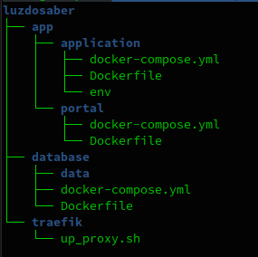
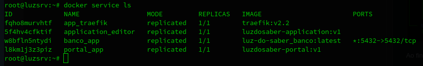
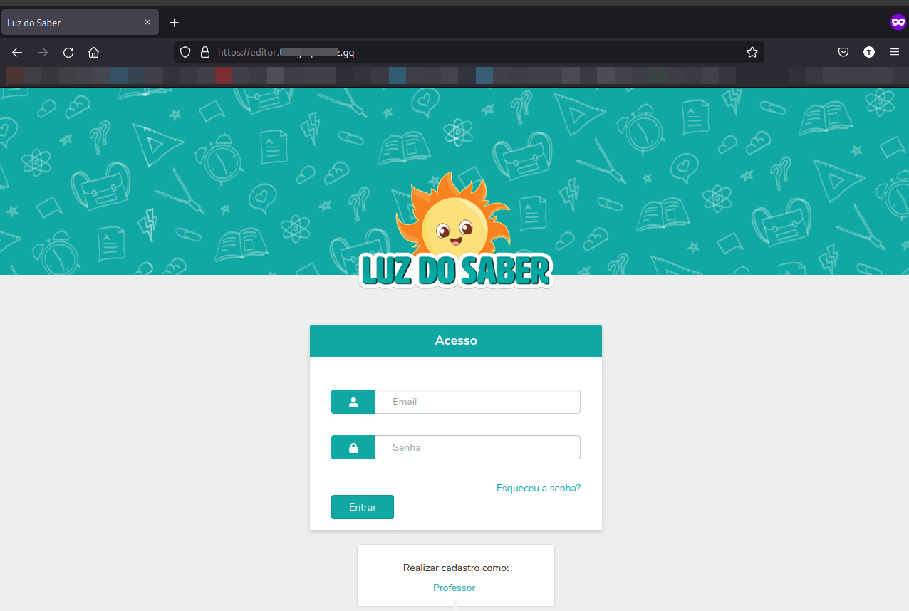
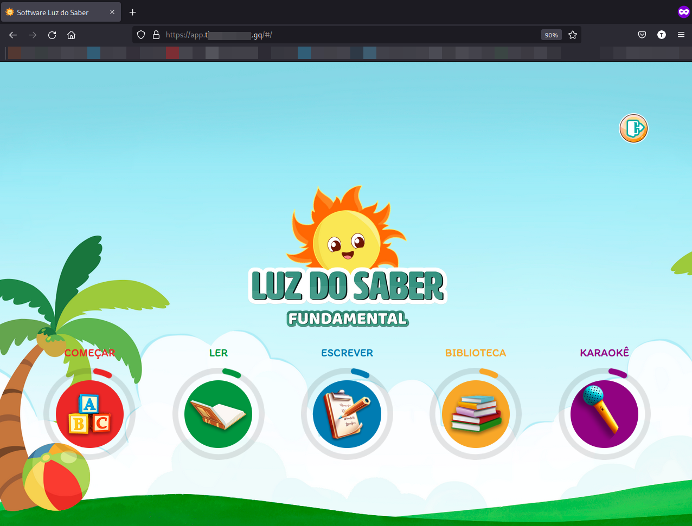

# Luz do Saber

Luz do saber é um aplicatico ......

## Sumário 

1. [História]()
2. [Agradecimentos]()
3. [Licença de uso GNU/GLP3]()
4. [Guia do usuário](./luzdosaber/Guia%20do%20Usu%C3%A1rio)
5. [Guia para manuteção de infraestrutura]()
6. [Criando e instalando uma nova instância do Luz do Saber](./luzdosaber#criando-e-instalando-uma-nova-inst%C3%A2ncia-do-luz-do-saber) 

## História

    Em construção ....

## Agradecimentos

    Em construção ....

## Licença de Uso

    Em construção ...

    [Saiba mais sobre a GPLv3](https://www.gnu.org/licenses/quick-guide-gplv3.html)

## Criando e instalando uma nova instância do Luz do Saber

Repositorio para criação de instância da aplicação luz do saber. 

Neste exemplo foi usado um dominio gratuito, e são necessárias um breve conhecimento sobre os seguintes assuntos: dominios, docker, aws, linux e banco de dados.

Foram criados arquivos .md numerados para seguir uma sequencia lógica. os arquivos que não estão nos repositorios das aplicações estão na pasta luzdosaber:

Ao final, queremos chegar ao objetivo de todos os serviços rodando:

